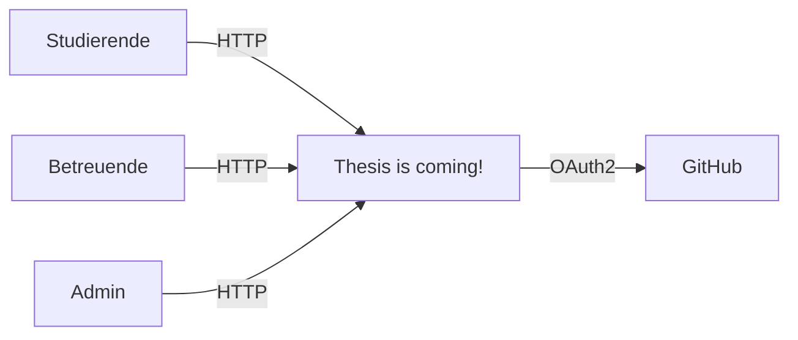
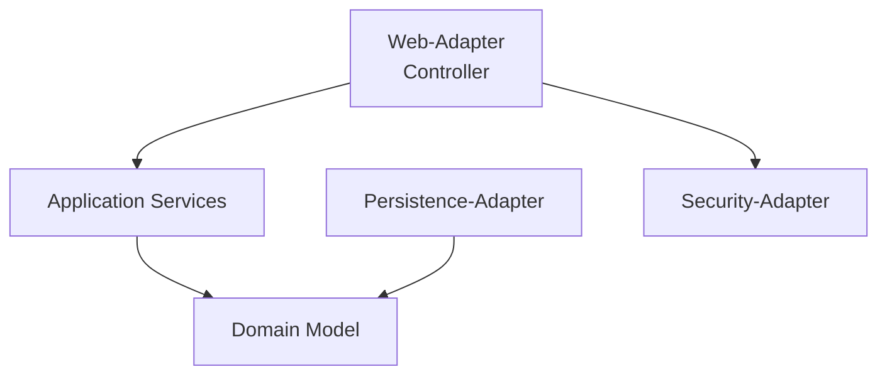

# arc42 – Thesis is coming!

## 1. Einführung und Ziele

Das System hilft Studierenden der Informatik dabei, passende
Betreuer:innen und Themen für ihre Abschlussarbeit zu finden.
Betreuer:innen pflegen Profile mit Fachgebieten, Themenvorschlägen
und Dateien. Studierende können per Matching nach Interessen filtern.

### Qualitätsziele

| Priorität | Ziel | Beschreibung |
|-----------|------|--------------|
| 1 | Barrierefreiheit | Die Anwendung ist mit Screenreader und Tastatur bedienbar |
| 2 | Wartbarkeit | Strikte Onion-Architektur verhindert ungewollte Abhängigkeiten |
| 3 | Sicherheit | Zugriffskontrolle über Rollen (Admin, Betreuer, Studi) |

### Stakeholder

| Rolle | Erwartung |
|-------|-----------|
| Studierende | Schnell passende Themen und Betreuer:innen finden |
| Betreuende | Profil pflegen, Themen und Dateien verwalten |
| Administratoren | Betreuende anlegen und verwalten |

---

## 2. Randbedingungen

**Technisch:**
- Java 21, Spring Boot 3
- Spring Web MVC (Controller), Spring Data JDBC (Persistenz)
- PostgreSQL als Datenbank, Flyway für Migrationen
- Thymeleaf für serverseitiges HTML-Rendering
- GitHub OAuth2 für Authentifizierung
- Docker Compose für den Betrieb

**Organisatorisch:**
- Das System muss als strikte Onion-Architektur (DDD) umgesetzt
  sein. Die Einhaltung wird durch ArchUnit-Tests automatisch geprüft.
- Keine Passwörter oder Secrets dürfen in der Git-Historie liegen.

---

## 3. Kontextabgrenzung

Das System ist eine Webanwendung, die über den Browser bedient wird.
Einziges externes System ist GitHub für den Login per OAuth2.

| Nachbarsystem | Schnittstelle | Richtung |
|---------------|---------------|----------|
| Browser | HTTP/HTTPS | bidirektional |
| GitHub OAuth2 | OAuth2 Authorization Code Flow | eingehend |
| Dateisystem | Lokaler Speicher für Uploads | intern |

---

## 4. Lösungsstrategie & Bausteinsicht (Level 1)

Das System folgt einer strikten Onion-Architektur.
Abhängigkeiten zeigen immer nach innen – äußere Schichten
kennen innere, aber nie umgekehrt.

### Bausteine

**Domain Model**
Enthält die fachlichen Aggregate `Betreuer`, `Thema` und `Datei`
als reine Java-Klassen ohne Framework-Abhängigkeiten.

**Application Services**
Orchestrieren die Geschäftsvorfälle (z.B. `BetreuerAnlegenService`,
`MatchingService`) und nutzen Repository-Interfaces aus der Domain.

**Web-Adapter**
Spring MVC Controller nehmen HTTP-Requests entgegen, rufen
Application Services auf und rendern Thymeleaf-Templates.

**Persistence-Adapter**
Implementiert die Repository-Interfaces mit Spring Data JDBC.
Records mappen zwischen Domain-Objekten und Datenbanktabellen.

**Security-Adapter**
Konfiguriert Spring Security mit GitHub OAuth2. Der
`CustomOAuth2UserService` weist Nutzern die Rolle
`BETREUER`, `ADMIN` oder `USER` zu.